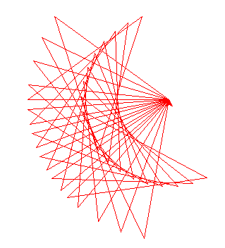

## 학생용 예제
### 1. 터틀 그래픽을 이용하여 다음과 같은 삼각형을 그려보자. 삼각형의 좌표는 신경 쓰지 않고 모습이 정삼각형이 되도록 거북이를 움직여 보도록 한다.

[출력형태]  
  
  


### 2. 터틀 그래픽을 사용하여 원과 다각형을 그려보자. 운을 그리는 명령어는 다름과 같다.
> ※ t.circle(100)  # 반지름이 100인 원이 그려진다.


[출력형태]  
  


### 3. 터틀 그래픽에서 거북이를 이동시켜서 다음과 같은 그림을 그려보자. forward()와 right(), left()함수를 사용한다.

[출력형태]  
  


> ※ left(90)은 왼쪽으로 90도 회전, right(90)은 오른쪽으로 회전
### 4. 터틀 그래픽에서 width() 함수를 호출하면 거북이가 그리는 선의 두께를 두껍게 한다. 거북이를 이동하여 다음과 같이 두께가 10인 선을 그려보자.
> ※ t.width(10)을 호출하면 선의 두께가 10이 된다

[출력형태]  
  


### 5. 터틀 그래픽에서 color()함수를 호출하면 거북이가 그리는 선의 색상을 변경할 수 있다. 색상을 파랑색으로 변경하여 다음과 같이 길이가 100픽셀인 선을 그려보자

[출력형태]  
  


> ※ t.color("blue")을 호출하면 선이 색상이 파랑색이 된다. 생상은 영어 단어로 표시해야 한다
### 6. 터틀 그래픽에서는 거북이의 모양을 삼각형, 원, 사각형으로 변경할 수 있다. 같이 shape() 함수를 사용하면 된다. 사각형으로 변경하고 100픽셀 길이의 직선을 그려보자
```
t.shape("square")
```
[출력형태]  
  


> ※ "arrow","turtle","circle","square","triangle","classic"등의 모양이 가능하다
### 7. 다음 출력결과와 같이 터틀을 이용하여 그림을 그리시오 
터틀 그래픽에서 거북이가 이동할 때 선이 그려지지 않게하려면 t.up()하여 펜을 들 수 있다. 반대로 t.down()은 펜을 내려놓은 명령어 이다. 거북이를 화면좌표(100,200)으로 이동시키면 t.goto(100,200)을 호출한다. 

[출력형태]  
  


> ※ 터틀 그래픽의 좌표게는 수학 좌표계와 동일 한다. 화면 중앙이 원점 (0, 0)이 된다
### 8. 터틀 그래픽에서 t.circle(100)이라고 입력하고 실행하면 화면에 반지름이 100인 원이 그려진다. 이들 명령어를 조합하여 화면에 오륜기를 그리는 프로그램을 작성해 보자.

[출력형태]  
  


> ※ goto()를 이용하여 거북이를 원하는 좌표로 이동시킨다. 이동시키면서 선이 그려지지 않게 하려면 up()을 호출한다. 다시ᅟᅥᆫ을 그리려면 down()을 호출한다

## 반복문 예제
### 1. 터틀 그래픽을 사용하여 다음과 같은 원을 그리세요
(반복문 사용할 것)  
  


### 2. 터틀 그래픽과 반복문을 이용하여 정삼각형와 정사각형을 반복을 이용하여 화면에 그리시오

  


### 3. 터틀 그래픽과 반복문을 이용하여 사용자로부터 정수 n을받아서 n-각형을 그리는 프로그램을 작성할하시오

  

### 4. 터틀그래픽을 이용하여 시계를 작성해보자. 터틀그래픽의 stamp()함수를 호출하면 그 위치에 거북이를 찍을수 있다

  


### 5. 터틀그래픽과 반복문을 사용하여 눈모양을 그려보자
(하나의 패턴을 그리는 코드는 다음과 같다)
```
t.forward(100) ; t.forward(-30) ; t.left(60); 
t.forward(30);  t.forward(-30)
```

  


### 6. 터틀그래픽과 반복문을 이용하여 다음을 작성하여라.
(별을 그리는 코드를 반복한다. 하나의 별을 그리는 반복이 끝나면 left(10)을 실행한다)

  


### 7. 다음과 같이 거북이를 왕복 달리기시키는 프로그램을 작성해보자.

  
