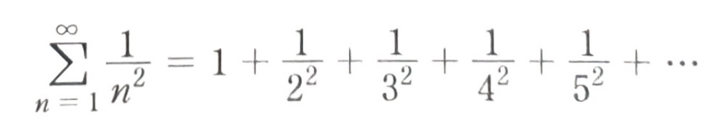

# 컴퓨터공학개론 - 과제 1

## 3.18.
맛나 식당의 메뉴 주문 프로그램을 개발하고자 한다. 이를 위하여 사용자에게 다음과 같은 1), 2), 3)의 메뉴를 보여주고 이 중에서 하나를 선택하도록 하자. 이때 아래 보기와 같이 메뉴에 없는 5, 6, 0과 같은 숫자가 입력되면 '메뉴를 다시 입력하세요: '가 출력되도록 한 후 다시 입력을 받도록 하자.

**실행결과**
```
맛나 식당에 오신 것을 환영합니다. 메뉴는 다음과 같습니다.
1) 햄버거
2) 치킨
3) 피자
1에서 3까지의 메뉴를 선택하세요 : 5
메뉴를 다시 입력하세요: 6
메뉴를 다시 입력하세요: 0
메뉴를 다시 입력하세요: 2
치킨을 선택하였습니다.
```

## 3.19
맛나 식당의 메뉴 주문 프로그램을 개발하고자 한다. 이를 위하여 사용자에게 다음과 같은 메뉴를 보여주고 이 중에서 하나의 알파벳 b, c, p를 선택하도록 하자. 이때 메뉴에 없는 알파벳이 입력되면 '메뉴를 다시 입력하세요: '가 출력되도록 한 후 다시 입력을 받도록 하자.

**실행결과**
```
맛나 식당에 오신 것을 환영합니다. 메뉴는 다음과 같습니다.
- 햄버거(입력 b)
- 치킨(입력 c)
- 피자(입력 p)
메뉴를 선택하세요(알파벳 b, c, p 입력) : x
메뉴를 다시 입력하세요(알파벳 b, c, p 입력) : c
치킨을 선택하였습니다.
```

## 3.21.
소수란 양의 자연수 중에서 1과 자기 자신이외의 약수를 가지지 않는 수를 말한다. 사용자로부터 양의 정수 n을 입력받은 후 이 숫자가 소수인지 아닌지를 판별하는 프로그램을 작성하시오.(힌트: n을 2부터 n-1까지의 정수로 모두 나누어 본다. 이 때 나누어 떨어지는 원소가 하나라도 있으면 소수가 아니다). 이때 수행 속도를 개선하기 위하여 2로 나누어 본 후 나누어지지 않을 경우 3, 5, 7, ...과 같은 홀수로 나눗셈을 시도하도록 코딩하여라.

**실행결과**
```
숫자를 입력하세요 : 5
5는 소수입니다
```

**실행결과**
```
숫자를 입력하세요 : 9
9는 소수가 아닙니다
```

## 3.22.
1이 아닌 양의 자연수 중에서 소수가 아닌 수를 합성수라고 한다. 이전 문제에서 사용한 소수를 판별하는 알고리즘을 사용하여 2에서 12까지의 수 중에서 다음과 같이 소수와 합성수를 출력하여라.

**실행결과**
```
2 : 소수
3 : 소수
4 : 합성수
5 : 소수
6 : 합성수
7 : 소수
8 : 합성수
9 : 합성수
10 : 합성수
11 : 소수
12 : 합성수
```

## 3.24
바젤 문제는 스위스 바젤시의 바젤 대학에 재직하던 야코프 베르누이와 요한 베르누이에 의해 제기된 것으로 다음의 급수를 닫힌 형식으로 나타내라는 것이었다.  
  
이 문제는 레온하르트 오일러에 의해 π²/6으로 수렴한다는 것이 증명되었다. 사용자로부터 정수 n을 입력 받아서 (1/1)²+(1/2)²+(1/3)²+...+(1/n)²을 구하는 프로그램을 작성하시오.

## 3.26
뱀 행렬 문제: 사용자로부터 숫자 1보다 크고 10보다 작은 값 n을 입력으로 받아서 다음과 같이 뱀의 몸통처럼 증가하는 이차원 배열을 출력하여라(이 배열은 마치 뱀의 몸통처럼 'ㄹ'과 같은 패턴을 그리며 수가 1씩 증가하는 형태의 배열이라서 편의상 뱀 행렬이라는 이름을 지었다.)

**실행결과**
```
n을 입력하시오 : 5
 1  2  3  4  5
10  9  8  8  6
11 12 13 14 15
20 19 18 18 16
21 22 23 24 25
```

## 3.29
다음과 같이 자동차의 연료 탱크 프로그램을 시뮬레이션하여 보자. 초기 연료의 양은 500으로 두자. 사용자가 주행을 하면 연료가 줄어들고 충전을 하면 연료가 증가한다. 이 때 연료의 사용과 충전은 -/+ 기호와 함께 입력하도록 한다. 반복문을 사용하여 사용자로부터 충전 또는 사용한 연료를 입력받아서 현재 남아있는 양을 계속 출력하고, 연료 탱크에 남아 있는 연료가 10% 미만이면 경고를 출력하고 프로그램 수행을 마친다.

**실행결과**
```
충전 또는 사용한 연료를 +/- 기호와 함께 입력하시오: +60
현재 탱크양은 560 입니다.
충전 또는 사용한 연료를 +/- 기호와 함께 입력하시오: -300
현재 탱크양은 260 입니다.
충전 또는 사용한 연료를 +/- 기호와 함께 입력하시오: -220
현재 탱크양은 40 입니다.
경고 : 연료가 10% 미만이니 충전하세요!
```

## 3.31
친화수(親和數)는 두 수의 쌍이 있어, 어느 한 수의 진약수를 모두 더하면 다른 수가 되는 것을 말한다. 220과 284의 쌍이 그 예인데, 220의 진약수는 1, 2, 4, 5, 10, 11, 20, 22, 44, 44, 110로 모두 더하면 284가 된다. 그리고 이 284의 모든 진약수 1, 2, 4, 71, 142를 모두 더하면 220이 된다. 1에서 200000 사이의 모든 친화수를 구해서 다음과 같이 출력해 보자.

**실행결과**
```
220의 친화수 284
284의 친화수 220
1184의 친화수 1210
1210의 친화수 1184
... 중간 생략 ...
18416의 친화수 17296
```