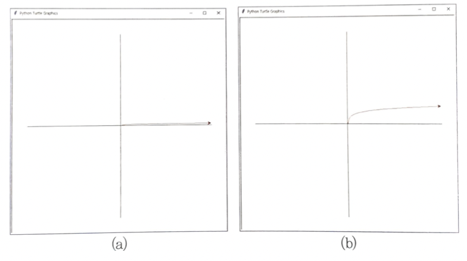

# 컴퓨터공학개론 - 과제 2

## 6.12.
튜플 데이터를 이용하면 임시변수를 사용하지 않고 두 변수의 값을 서로 교환(Swap)할 수 있다. 이 교환 방법을 이용하여 다음과 같이 주어진 리스트에서 가장 큰 값 12를 제일 마지막으로 옮겨 놓는 프로그램을 작성해 보라. (제약조건: 리스트의 요소를 살펴보기 위해 사용하는 for문의 인덱스 변수 i를 제외하고는 주어진 리스트 이외에 다른 어떤 변수도 추가로 사용해서는 안 된다)

실행 결과
```
주어진 리스트는 = [5, 6, 3, 9, 2, 12, 3, 8, 7]
가장 큰 수를 마지막으로 옮긴 결과 : [5, 3, 6, 2, 9, 3, 8, 7, 12]
```

## 6.13.
6.12.를 개선하여 처음에는 가장 큰 수를 제일 마지막으로 옮기고, 두 번째 단계는 끝으로 옮겨진 요소를 제외한 리스트에서 가장 큰 수를 뒤에서 두 번째 위치로 옮기며, 세 번째 단계에서는 뒤의 두 요소를 제외한 나머지 리스트에서 가장 큰 수를 뒤에서 세 번째로 옮긴다. 이를 일반화 하면 k 번째 단계에서는 뒤에서 k-1 개 요소를 제외하고, 남은 리스트에서 가장 큰 요소를 뒤에서 부터 k 번째 위치에 옮겨 놓는 일을 처리할 리스트가 남지 않을 때까지 반복하면 큰 수부터 차례로 뒤에 쌓이게 된다. 이를 거품(bubble) 정렬이라고 한다. 이를 구현해 보라 (힌트: sorted() 함수나, 리스트의 sort() 메소드를 사용하지 말고 구현하시오.)

실행 결과
```
주어진 리스트는 = [5, 6, 3, 9, 2, 12, 3, 8, 7]
정렬된 결과는 = [2, 3, 3, 5, 6, 7, 8, 9, 12]
```

## 6.21.
어떤 문자열을 뒤집었을 때에 원래의 문자열과 같은 것을 회문(palindrome)이라고 한다. 예를 들어 'mom'은 문자열을 뒤집어도 'mom'이 되므로 회문이다. 사용자로부터 임의의 문자열이나 문장을 입력받아서 이 문자열이 회문인지 아닌지 검사하는 코드를 작성하라. 입력으로는 다음과 같은 영문자를 입력으로 받으며, 대문자와 소문자, 공백, 마침표 등은 무시하도록 구현하여라.

실행 결과
```
문자열을 입력하시오 : racecar
회문입니다.
```

실행 결과
```
문자열을 입력하시오 : racecing
회문이 아닙니다.
```

실행 결과
```
문자열을 입력하시오 : A nut for a jar of tuna
회문입니다.
```

## 7.7.
math 모듈과 터틀 그래픽을 사용하여 다음을 구하여라.

(1) log(1)에서 log(300)까지 밑을 e로 하는 log() 값을 구하여 출력하여라. 이때 간격 값은 30으로 하여 출력하여라.

실행 결과
```
log(1) = 0.000
log(31) = 3.434
(...중략...)
log(241) = 5.485
log(271) = 5.602
```



(2) (1)번 문제에서 구한 log() 함수를 x축, y축을 가진 데카르트 좌표계에서 빨간색으로 나타내어라. 이 함수를 그림 (a)와 같이 터틀 그래픽을 이용하여 표현하여라(로그함수의 구간은 0에서 360까지의 값이며 x값의 증가 구간은 5로 두고 그리시오.)

(3) (2)번 문제에서 구한 log() 함수의 y값을 10배 확대하여 위의 그림 (b)와 같이 나타내시오.

(4) 다음과 같이 sin(), cos() 함수를 각각 빨간색과 파란색으로 그리시오. 그림에 나타난 삼각 함수의 입력 값은 -360에서 +360도까지이며 출력 값은 -1에서 1사이이다. 이 때 y값을 그림과 같이 100을 곱하여 그리시오.

## 7.9.
로미오와 줄리엣 두 사람이 가위바위보를 한다. 로미오와 줄리엣의 승부는 random 모듈의 randrange()를 통해서 생성한 난수를 바탕으로 한다. 출력 겨로가는 다음과 같이 로미오가 이기거나, 줄리엣이 이기거나, 비기는 결과가 나와야 한다.

실행 결과
```
로미오의 승부 : 가위
줄리엣의 승부 : 바위
줄리엣이 이겼습니다.
```
