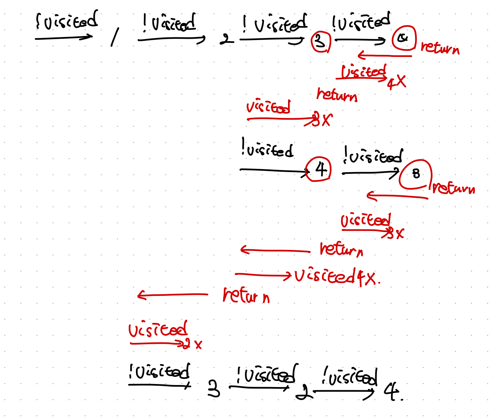

# N과 M (5)

N개의 자연수와 자연수 M이 주어졌을 때, 아래 조건을 만족하는 길이가 M인 수열을 모두 구하는 프로그램을 작성하시오. N개의 자연수는 모두 다른 수이다.

* N개의 자연수 중에서 M개를 고른 수열

## 코멘트

동아리 선배의 풀이 목록에 N과 M 시리즈가 있길래 궁금해서 풀어보았다.  
알고리즘을 공부하지 않은 1학년 새내기한테는 어려웠던것 같다.  
응애 나 알고리즘 초보

## 백트래킹
문제 타입 자체는 고등학교 확률과 통계 시절에 개념 공부하면서 많이 봤던 내용이다.  
도입하는 알고리즘도 비슷한 구조지만 백트래킹 알고리즘을 잘 모르고 있었다.  

  