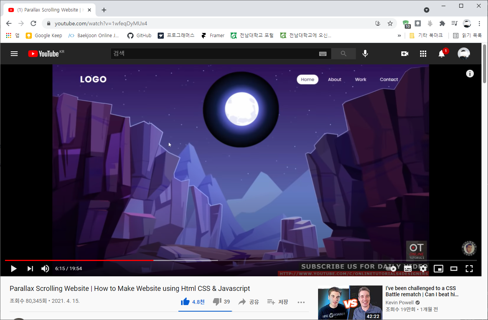
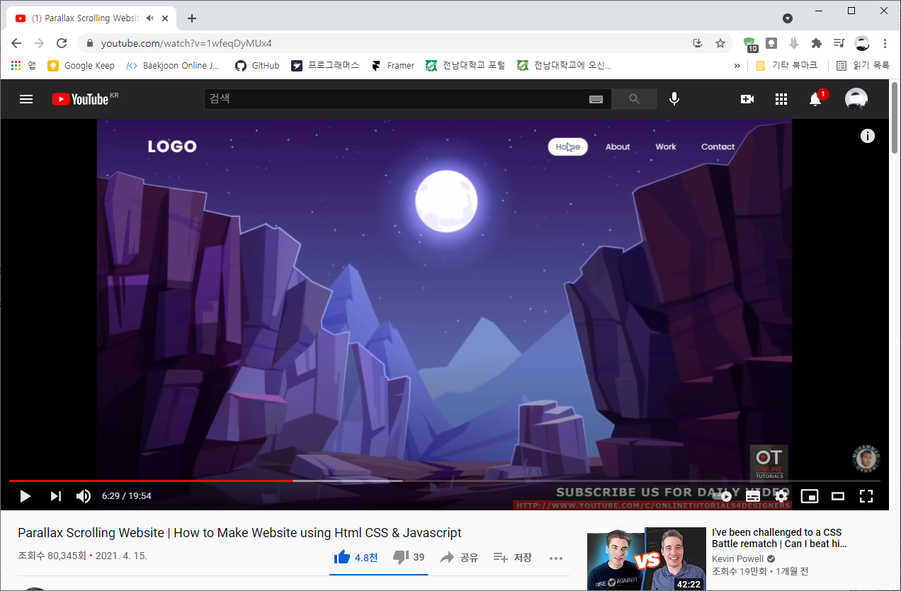

# mix-blend-mode
> `mix-blend-mode` CSS 속성은 어느 요소의 콘텐츠가 자신의 배경 및 부모와 어떻게 혼합되어야 하는지 지정합니다.  
>  
> [mix-blend-mode: MDN Web Docs](https://developer.mozilla.org/ko/docs/Web/CSS/mix-blend-mode)  

```css
element {
    mix-blend-mode: mode;
}
```

## Example
[MDN WEB Docs의 예제 문단](https://developer.mozilla.org/ko/docs/Web/CSS/mix-blend-mode#examples) 참고

### mix-blend-mode: screen;
| Before | After |
| --- | --- |
|  |  |

_Source: [Online Tutorials](https://www.youtube.com/watch?v=1wfeqDyMUx4)_