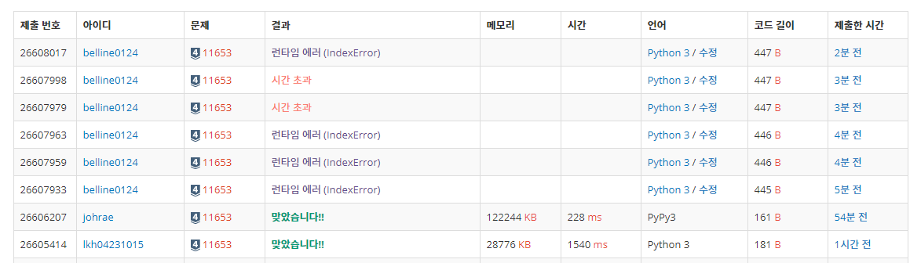

# 11653
> 소인수분해

풀이 난이도: (하)

## 런타임 에러
수학문제를 풀 때 소인수분해가 필요하면 머릿속에 있는 소수 리스트에서 소수들을 뽑아 계산해왔다.  
이 문제에서도 별 생각없이 소인수분해를 하려면 소수가 필요할것이라 판단해 소수 리스트를 만드는 코드를 먼저 짰다.  

```python
c = 50000
pl = [True for i in range(c+1)]
pl[0] = False
pl[1] = False
for i in range(2, c+1):
    for j in range(2, c//i+1):
        pl[i*j] = False
pln = []
for i in range(len(pl)):
    if pl[i]:
        pln += [i]
```

그 뒤에 소수 리스트에서 값을 뽑아서 나눗셈을 시켰다.
```python
n = int(stdin.readline())
loop = True
i = 0
while loop:
    if n == 1:
        loop = False
    calc = n / pln[i]
    if calc == n // pln[i]:
        print(pln[i])
        n = calc
    else:
        i += 1
```

결과: 런타임 에러 (IndexError)  

소수 리스트 안에 있는 소수들로는 소인수분해가 완료되지 않았기 때문에 IndexError가 발생한것으로 판단하고 c 값을 키웠다.  

결과: 시간 초과

  

c(소수 리스트 생성 시 최댓값) 값의 범위를 파악하기 위해 브루트포스를 시도했으나 다른 채점 사례들의 사용 메모리, 시간, 코드 길이가 내가 짠 코드의 경향과 확실히 달라서 다른 풀이를 알아봤다.

### 제대로 생각해!!
런타임 에러의 원인은 소인수분해에 대한 내 인식이 잘못되어있었기 때문이었다.  
머리로 수학을 풀때는 수를 가장 빨리 작게 만들 수 있는 소수를 가져다가 소인수분해를 해왔지만, 컴퓨터로 처리할때는 그럴 필요가 없었다.  

어차피 제수를 작은값부터 큰값을 향해 올려가면 에라토스테네스의 체 마냥 합성수는 알아서 걸러진다.  

## 결과
코드가 간단해졌다.