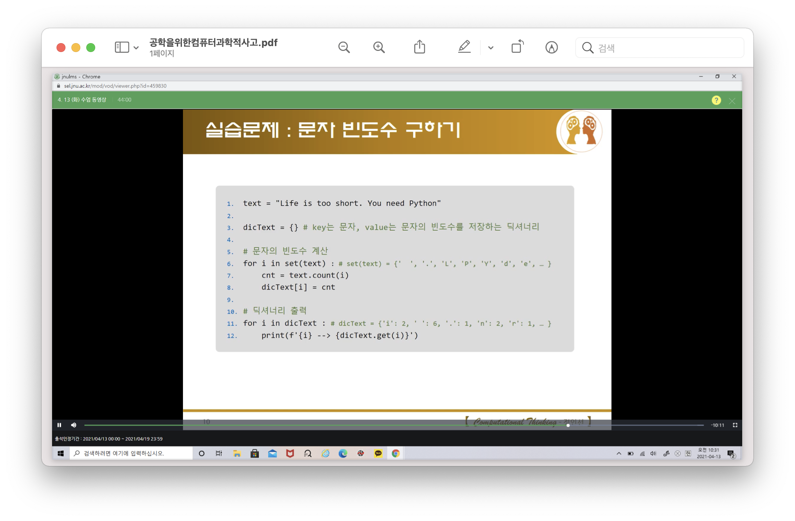

# 과제 #4
수업 동영상의 "문자 빈도수 구하기"를 수정하여 아래의 주어진 문자열 내에 나타나는 각 문자의 빈도수를 계산하여 출력하는 프로그램을 작성하시오.

## 문자열
```
Success is not the key to happiness.
Happiness is the key to success.
If you love what you are doing, you will be successful.
- Albert Schweitzer
```

## 문자의 빈도는 알파벳, 특수 문자만 계산
* 공백 문자: 공백(사이띄기), 줄바꿈(\n), 탭(\n)등을 의미
예를 들어 아래처럼 문자열이 두 줄로 구성된 문자열이라면
```
Success is
not the key
```
```
Success_is\n
not_the_key
```
공백(_)은 3개이며 줄바꿈(\n)은 1(... is 다음에)개 나타남. 즉, 총 4개의 공백 문자가 있음.  
* 공백, 줄바꿈, 탭 등을 제거 후 알파벳과 특수 문자만을 이용하여 문자 빈도 계산: replace 함수 이용
* `string.replace(old, new)`
예) `string.replace('a', 'b')` 이라면 string 문자열 내의 `'a'` 문자를 `'b'` 문자로 변경 (`string = happiness` --> `string = hbppiness`)

## 알파벳의 대소문자를 구분하지 않음
"**P**ython **p**rogramming"일 경우 알파벳 p의 빈도는 2

## 문자와 빈도수는 딕셔너리를 이용하여 저장하고 출력
key = 문자, value = 빈도수

## 교수가 제시한 방법
* [normal.py](./normal.py)
